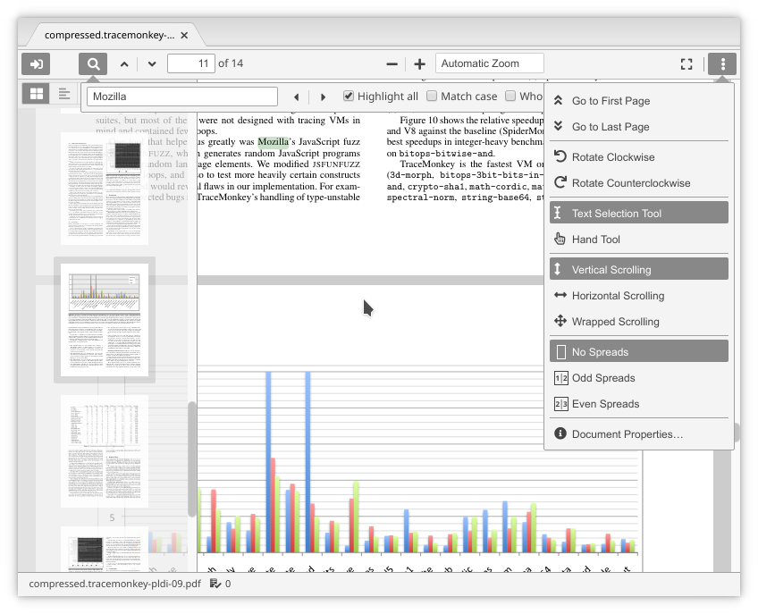

# pdfjs-viewer

pdfjs-viewer is a package for the [Atom editor](https://atom.io/) that makes it possible to view PDF files in Atom panes. It is a wrapper around Mozilla's [PDF.js](https://github.com/mozilla/pdf.js) library including its viewer application, adapted for the Atom environment.

## Comparison with other PDF viewer packages

pdfjs-viewer has the same purpose as the [pdf-view](https://atom.io/packages/pdf-view) and [pdf-view-plus](https://atom.io/packages/pdf-view-plus) packages, but differs in several respects:

Other than pdf-view, this package features the full viewer UI, including

-   outline / thumbnail / attachments view,
-   text search,
-   zoom levels,
-   fullscreen mode,
-   rotation,
-   text selection and copy, and
-   annotations.

Other than pdf-view-plus, the viewer has been reskinned in compliance with the [request](https://mozilla.github.io/pdf.js/getting_started/) of PDF.js developers not to use it unmodified. UI elements blend in with the current Atom theme. Almost all icons have been replaced with alternatives from [Font Awesome](https://fontawesome.com/).

Moreover, links in the PDF have been made functional (internal and external, including `file:` links). Some UI elements and associated keyboard shortcuts have been removed because they serve no purpose within Atom.

## Installation

Install from Atom's Settings/Install dialog (search for `pdfjs-viewer`) or via `apm install pdfjs-viewer`.

## Usage

PDF files can be opened from the Atom user interface, e.g. from the project tree view, or programmatically through `atom.workspace.open()`.

The PDF.js viewer supports a number of [keyboard shortcuts](https://github.com/mozilla/pdf.js/wiki/Frequently-Asked-Questions#faq-shortcuts), the most important ones are:

| shortcut                                      | function                |
| --------------------------------------------- | ----------------------- |
| <kbd>n</kbd> or <kbd>j</kbd>                  | next page               |
| <kbd>p</kbd> or <kbd>k</kbd>                  | previous page           |
| <kbd>ctrl</kbd>+<kbd>f</kbd>                  | find                    |
| <kbd>ctrl</kbd>+<kbd>g</kbd>                  | find next               |
| <kbd>shift</kbd>+<kbd>ctrl</kbd>+<kbd>g</kbd> | find previous           |
| <kbd>ctrl</kbd>+<kbd>+</kbd>                  | zoom in                 |
| <kbd>ctrl</kbd>+<kbd>-</kbd>                  | zoom out                |
| <kbd>ctrl</kbd>+<kbd>0</kbd>                  | reset zoom              |
| <kbd>r</kbd>                                  | rotate clockwise        |
| <kbd>shift</kbd>+<kbd>r</kbd>                 | rotate counterclockwise |
| <kbd>F4</kbd>                                 | toggle sidebar          |

Zoom is also possible via <kbd>ctrl</kbd> + the mouse wheel. A click on an internal link scrolls to that position in the document, a click on an external link opens it with the associated application. If modified by <kbd>ctrl</kbd> or <kbd>shift</kbd>, external links are opened in a separate Atom window.

If the PDF has been generated by *TeX with SyncTeX support, a right click opens the source file in Atom at the corresponding line.

The package watches for file changes and reloads the PDF if necessary. Viewer panes are persistent across Atom runs.

---

This software is copyrighted © 2020 by Carsten Allefeld and released under the terms of the MIT license, except for the included modified copy of the [PDF.js](https://github.com/mozilla/pdf.js) library and viewer (pre-built release [pdfjs-2.3.200-dist](https://github.com/mozilla/pdfjs-dist/releases/tag/v2.3.200)), © Mozilla and individual contributors and released under the terms of the Apache-2.0 license.
